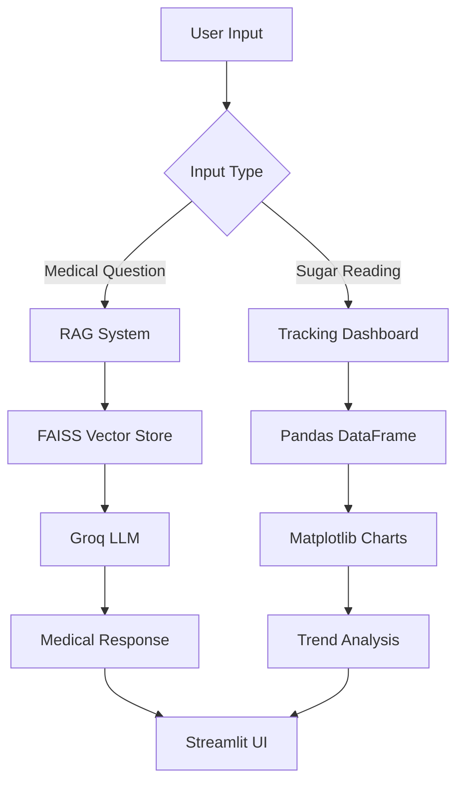

# 🏥 MediBot Pro - AI Medical Assistant with Diabetes Management

A comprehensive medical AI assistant that combines evidence-based medical information with practical diabetes management tools. Features an intelligent chatbot powered by Retrieval-Augmented Generation (RAG) and an integrated blood sugar tracking system.


## 🌟 Features

### 🤖 AI Medical Chatbot
- **RAG-Powered Responses**: Evidence-based answers from medical literature
- **Diabetic Foot Ulcer Expertise**: Specialized knowledge in diabetes complications
- **Conversational Memory**: Maintains context across conversations
- **Multi-session Support**: Manage multiple chat conversations
- **Emergency Detection**: Identifies and escalates critical medical situations

### 📊 Diabetes Management Dashboard
- **Blood Sugar Tracking**: Log and monitor glucose levels
- **Meal Context Logging**: Record readings with meal timing context
- **Trend Analysis**: Visualize glucose patterns over time
- **Risk Alerts**: Automatic hypoglycemia/hyperglycemia detection
- **Image Upload**: Capture glucose meter readings via camera

### 🛡️ Safety Features
- **Medical Disclaimers**: Clear educational-purpose warnings
- **Professional Boundaries**: Never provides diagnoses or prescriptions
- **Healthcare Referrals**: Always recommends consulting professionals
- **Privacy-Focused**: Local data processing where possible

## 🚀 Quick Start

### Prerequisites
- Python 3.8 or higher
- Groq API account ([Sign up here](https://console.groq.com/))
- Medical PDF documents (optional, for knowledge base)

### Installation

1. **Clone the repository**
```bash
git clone https://github.com/yourusername/medibot-pro.git
cd medibot-pro
```

2. **Install dependencies**
```bash
pip install -r requirements.txt
```

3. **Set up environment variables**
```bash
echo "GROQ_API_KEY=your_groq_api_key_here" > .env
```

4. **Prepare medical knowledge base**
```bash
# Place PDF files in data/ directory
mkdir data
# Add your medical PDFs to the data folder
```

5. **Build vector database**
```bash
python create_memory_for_llm.py
```

6. **Launch the application**
```bash
streamlit run medibot.py
```

## 📁 Project Structure

```
medibot-pro/
├── medibot.py                 # Main Streamlit application
├── create_memory_for_llm.py   # PDF processing & vector store creation
├── connect_memory_for_llm.py  # RAG chain implementation
├── data/                      # Medical PDF documents
├── vectorstore/               # FAISS vector database
├── requirements.txt           # Python dependencies
└── README.md                  # This file
```

## 💡 Usage Examples

### Medical Q&A
```
User: "What are the early signs of diabetic foot ulcers?"
MediBot: Provides evidence-based information with prevention strategies
```

### Blood Sugar Tracking
- Log fasting, pre-meal, and post-meal glucose levels
- Visualize trends with interactive charts
- Receive automatic risk assessments
- Track patterns by meal type and time of day

### Multi-session Management
- Start new conversations for different topics
- Switch between chat histories
- Maintain separate contexts for different users

## 🏗️ Architecture



## 🔧 Configuration

### Environment Variables
```bash
GROQ_API_KEY=your_groq_api_key_here
```

### Customization Options
- Modify `MEDICAL_CATEGORIES` in `medibot.py` for specialized knowledge
- Adjust chunk size in `create_memory_for_llm.py` for different document types
- Customize glucose thresholds in the sugar tracking module

## ⚠️ Important Disclaimer

**MediBot Pro is an educational tool and NOT a substitute for professional medical care.**

- ❌ **Does not provide medical diagnoses**
- ❌ **Does not prescribe treatments** 
- ❌ **Not for emergency medical situations**
- ✅ **Provides general health information**
- ✅ **Always recommends consulting healthcare professionals**

For medical emergencies, contact your local emergency services immediately.

## 🎯 Use Cases

### For Patients
- General medical information seeking
- Diabetes management support
- Medication education
- Symptom understanding

### For Healthcare Education
- Medical student training
- Patient education tool
- Clinical reference assistant

### For Developers
- RAG implementation reference
- Medical AI safety patterns
- Streamlit application template

## 🤝 Contributing

We welcome contributions! Please see our [Contributing Guidelines](CONTRIBUTING.md) for details.

### Development Setup
```bash
# Create virtual environment
python -m venv venv
source venv/bin/activate  # On Windows: venv\Scripts\activate

# Install development dependencies
pip install -r requirements-dev.txt
```

## 📊 Performance

- **Response Time**: < 3 seconds for most queries
- **Knowledge Base**: Supports thousands of medical documents
- **Concurrent Users**: Streamlit supports multiple simultaneous users
- **Data Persistence**: Chat history and sugar data maintained per session

## 🔮 Roadmap

- [ ] Voice interface integration
- [ ] Medication interaction checker
- [ ] Multi-language support
- [ ] Exportable health reports
- [ ] Mobile app version

## 📄 License

This project is licensed under the MIT License - see the [LICENSE](LICENSE) file for details.

## 🙏 Acknowledgments

- Medical literature providers and researchers
- Groq for high-performance LLM inference
- HuggingFace for embedding models
- LangChain for the RAG framework
- Streamlit for the web framework

## 📞 Support

---
- **Email**: aheed.study@gmail.com
---

<div align="center">

**⭐ If this project helps you, please give it a star on GitHub!**

*Making medical information more accessible through responsible AI*

</div>
